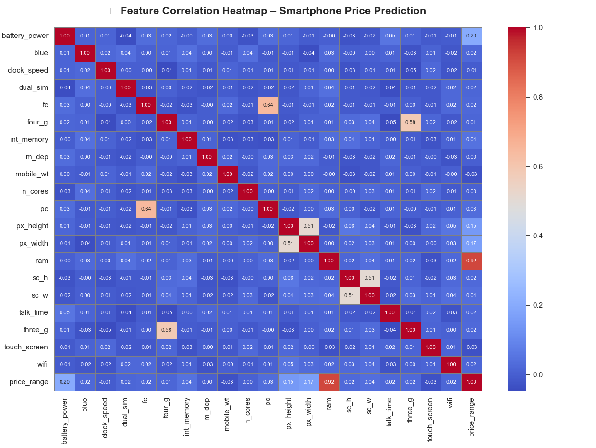

# 📱 SmartPriceML – Smartphone Price Prediction using ML

SmartPriceML is a machine learning project that predicts the price range of smartphones based on their technical specifications like RAM, battery power, camera resolution, and more.

---

## 📂 Dataset

Used the [Mobile Price Classification Dataset](https://www.kaggle.com/datasets/iabhishekofficial/mobile-price-classification) from Kaggle.

- 2,000 smartphone records
- Features: RAM, Battery, Camera, Storage, etc.
- Target: `price_range` (0 = Low, 3 = High)

---

## 🧠 ML Model

- Model: **Random Forest Classifier**
- Accuracy: ~87–90%
- Evaluation: Classification report with precision, recall, and F1-score

---

## 🧪 Exploratory Data Analysis (EDA)

### 🔥 Feature Correlation Heatmap


### 💾 RAM vs Price Range


---

## 💻 Technologies Used

- Python
- pandas, matplotlib, seaborn
- scikit-learn
- Jupyter/VS Code

---

## 🚀 How to Run

1. Clone the repository
2. Install dependencies:
   ```bash
   pip install -r requirements.txt
3. python smartphone_price_predictor.py
4. python eda_visuals.py

🙋‍♂️ Author
Nikhil Singh
📧 nikhilsingh652004@gmail.com
GitHub :- https://github.com/tstnikhil4356
LinkedIn :- https://www.linkedin.com/in/nikhil-singh-b8b559237/